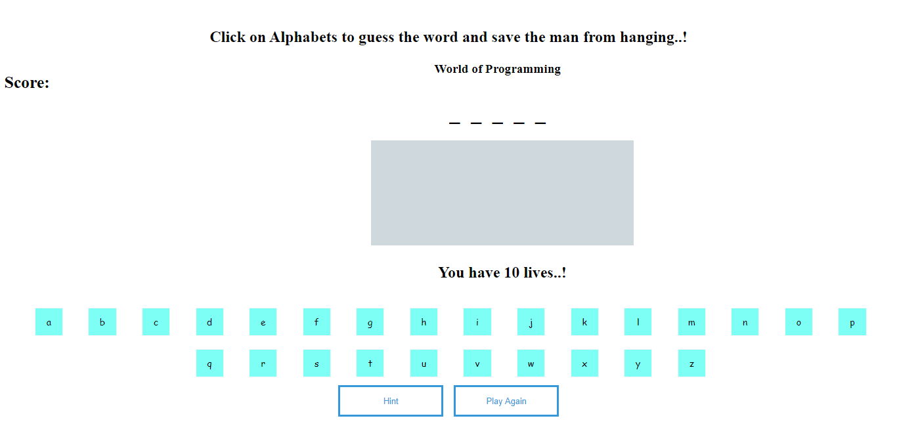
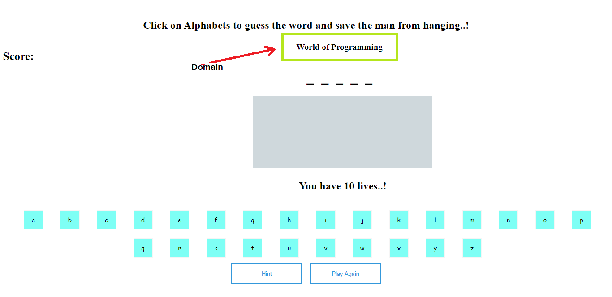
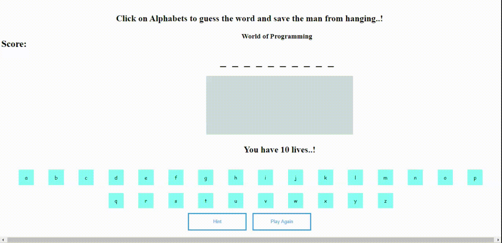

# Hangman-Game
#### Hangman Game is a word guessing game which gradually sets up to hang the man on every wrong guess.

This Game consists of three levels. Namely Easy, Medium and Hard with different number of Lives respectively.

### ---> [Click here for a Live Demo ](https://cranky-varahamihira-be7361.netlify.app/)

### How to Play ?

1. Select the **Level of Hardness** you would Like to Play (Number of Lives Change based on the level you select)
###### _Refer Below Image_

2. Once you select the level of hardness, You will be landing on the *Game Page*
###### _Refer Below Image_

3. On the Game page right above the blanks that fill alphabets, you will find the **domain** to which the word is related to
###### _Refer Below Image,(Domain in This Case is **Programming**)_

4. start **Guessing** the words based on the **domain**, Make sure that you will not make *wrong guesses* more than the number of *lives* you have. (**GAME WILL BE OVER IF LIVES COUNT REACHE TO ZERO**) 
###### _Refer Below GIF_

> This Game is completely built with JavaScript (DOM).
